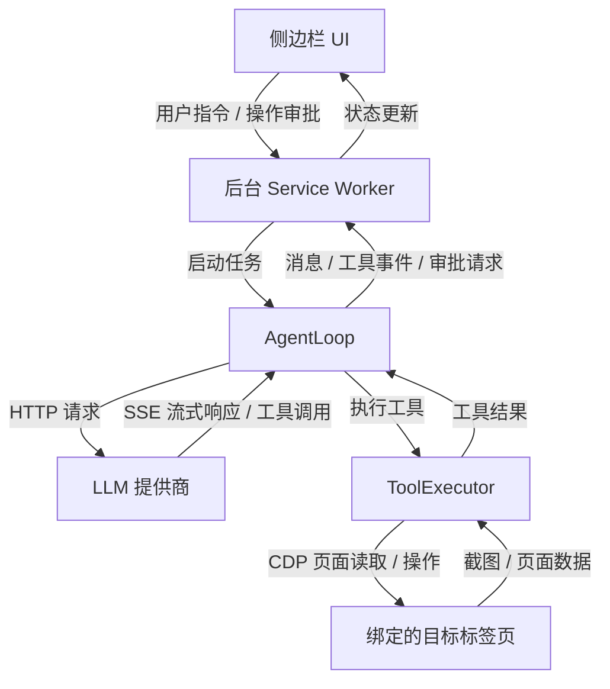

# NekoPilot 🐱

NekoPilot 是一个浏览器侧边栏插件。它可以接入 LLM 为你操作浏览器页面。

  


> Claude Fable 5 已将该插件与[Claude browser use 最佳实践](https://claude.com/blog/best-practices-for-computer-and-browser-use-with-claude)对齐

---

## 特性

- **仿真浏览器控制**：通过 CDP 派发真实鼠标 / 键盘事件，亦可改用 JS 派发。
- **兼容两种接口**：
  - OpenAI Completions
  - Anthropic Messages
- **权限可控**：可切换审批与自动模式，审批模式下点击、滑动、输入等操作需要人工批准
- **点选页面元素**：手动选择网页按钮，文本等，将元素信息附加到指令中。
- **JavaScript 沙箱**：通过轻量 QuickJS 沙箱执行代码，可计算数学问题或分析数据。
- **截图上下文管理**：对于模型对页面的截图，支持缩放和旧截图清理，控制模型上下文占用。

## 工具集

| 工具 | 作用 |
| --- | --- |
| `execute_js` | 在独立沙箱中执行纯 JavaScript 代码，无网络，不可访问页面资源；可在设置中关闭 |
| `screenshot` | 截屏，支持设置缩放 |
| `read_page_text` | 读取页面文本（`body.innerText`），支持通过 `limit` / `offset` 分段读取 |
| `read_page` | 读取简化 DOM 树 |
| `read_page_interactive` | 列出可见的可交互元素 |
| `click` | 按坐标或 selector 点击，默认使用 CDP，可改用 JS 点击 |
| `keyboard_type` | 输入文本、发送按键或组合键，可先聚焦指定元素；文本输入支持 CDP、JS 赋值或逐字符键盘事件 |
| `scroll` | 在指定位置派发鼠标滚轮事件，支持水平和垂直滚动 |
| `drag` | 按起点和终点坐标长按拖拽 |
| `navigate` | 打开指定网址 |
| `wait` | 等待指定毫秒数 |
| `find_element` | 按文本搜索元素 |
| `get_element_text` | 读取指定元素的文本 |
| `hover` | 按坐标或 selector 移动鼠标，触发悬停效果 |
| `handle_dialog` | 接受或拒绝原生 alert、confirm、prompt 及 beforeunload 弹窗，可填写 prompt 文本 |
| `get_element_rect` | 获取指定元素的坐标和尺寸 |

selector 是 `#n` 元素引用，由各种读取工具返回。

工具定义见 [`src/tools/definitions.ts`](src/tools/definitions.ts)。

---

## 快速开始

### 1. 构建扩展

需要 Node.js 22.13 或更高版本，以及 pnpm 11.19.0。

```bash
pnpm install --frozen-lockfile
pnpm build
```

### 2. 安装到 Chrome（或Edge等Chromium内核浏览器）

1. 打开 `chrome://extensions`
2. 开启 **开发者模式**
3. 点击 **加载已解压的扩展程序**，选择仓库内的 `dist` 目录

### 3. 配置 API

点击扩展图标，打开侧边栏，然后点击右下角齿轮图标进入设置页面，填写这些：

- **接口类型**：`OpenAI` 是 OpenAI Completions 接口，`Anthropic` 是 Anthropic Messages 接口
- **Base URL**：提供商API端点，例如 `https://api.openai.com/v1`、`https://api.anthropic.com/v1`
- **API Key**：你的密钥
- **模型**：提供商提供的模型ID，可点击右侧按钮从模型提供商拉取模型列表

### 4. 使用

在任意网页打开插件，输入指令开始。例如：

- 帮我把这个表单填好后提交
- 找到所有评论里的差评，摘抄给我
- 打开 GitHub trending，把前 5 个项目的标题列出来

发送指令后，Agent会留在当前标签页继续操作，直接切换标签页不会影响Agent。在底栏可以更改Agent操作的标签页。

---

## 项目结构

```
src/
├── background/         # MV3 Service Worker + CDP 会话管理
│   ├── index.ts
│   └── cdp.ts
├── agent/              # LLM Agent Loop（observe → think → act）
│   ├── loop.ts         # 流式调用 + 工具循环 + 中断控制
│   └── types.ts
├── tools/              # 工具系统
│   ├── definitions.ts  # JSON Schema 定义
│   ├── executor.ts     # CDP 实际执行
│   └── types.ts        # OpenAI / Anthropic schema 适配
├── sidepanel/          # 侧边栏 UI（聊天 / 时间线 / 思考块）
│   ├── App.tsx          # 事件处理与聊天状态
│   ├── model.ts         # 展示模型、分组与工具摘要
│   ├── timeline.tsx     # 思考 / 工具 / 审批时间线
│   ├── markdown.tsx     # Markdown 与流式公式兼容
│   └── controls.tsx     # 元素引用标签与通用控件
├── components/
│   ├── ui/              # shadcn/ui 基础组件
│   └── ai-elements/     # AI Elements 聊天组件
├── options/            # 设置页（BYOK 配置）
└── shared/             # 主题、消息通信、存储
```

数据流概览：



## 技术栈

- **构建** — Vite 6 + TypeScript 5（严格模式）
- **UI** — React 19 + shadcn/ui + AI Elements + Tailwind CSS 4
- **内容渲染** — Streamdown + remark-gfm / remark-math / KaTeX
- **主题** — shadcn/ui 默认 Neutral 配色，支持明亮、暗黑与跟随系统
- **运行时** — Chrome MV3 Service Worker
- **包管理器** — pnpm

## 隐私

- API Key 仅保存在本地浏览器的 `chrome.storage.local`。
- 所有 LLM 请求由扩展直连你配置的提供商。
- 截图、页面文本只发送给你选定的模型。

## 贡献

欢迎 issue 与 PR。

进入开发模式（watch + 增量构建）：

```bash
pnpm dev
```

提交前请：

```bash
pnpm build       # 必须通过 tsc 严格检查
pnpm test:ui     # 生产构建 + 浏览器 UI 回归检查
```

UI 检查默认使用已安装的 Chrome，可通过 `PLAYWRIGHT_CHANNEL` 选择其他已安装的浏览器通道。

需要人工检查页面截图时，运行 `pnpm test:ui:screenshots`；截图输出到 `test-results/` 和 `artifacts/ui/`。

提交信息使用 [Conventional Commits](https://www.conventionalcommits.org/zh-hans/v1.0.0/) 风格。

## TODOs

- [ ] 支持附件上传（对的，现在的附件按钮只是摆设）
- [ ] 历史对话保存
- [ ] 支持多标签页操作
- [ ] 为其它harness暴露MCP接口

## License

[Apache License 2.0](LICENSE)
